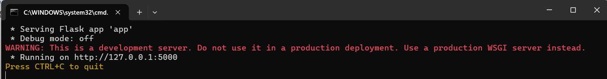

# 自用英华学堂自动刷课脚本，可识别验证码

刷课最好从学习记录里面点进去，最好是进到视频页面再点一下左边的课不点好像总是从第一课开始刷（技术问题）

### 油猴(篡改猴)代码

```js
// ==UserScript==
// @name         英华学堂自动播放3.1
// @namespace    http://tampermonkey.net/
// @version      3.1
// @description  修改的某位大佬的刷课插件
// @author       TMT
// @match        https://zswxy.yinghuaonline.com/user/*
// @grant        none
// ==/UserScript==

let totalCourses = document.getElementsByClassName("detmain-navlist")[0].getElementsByClassName("item").length;
let videoElements = document.getElementsByTagName("video");
let courseGroups = document.getElementsByClassName("group two ");
let navlist = document.getElementsByClassName("detmain-navlist")[0];
let item = navlist.getElementsByClassName("item");
let currentCourseIndex = 0;
let yz = 0;  // 验证码检测状态，0 表示未检测到，1 表示正在处理
let intervalId;  // 保存setInterval的ID

// 展开所有章节
for (let i = 0; i < courseGroups.length; i++) {
    courseGroups[i].className = "group two on";
}


// 定位当前观看位置
//for (let i = 0; i < totalCourses; i++) {
//    if (item[i].getElementsByTagName("a")[0].href === window.location.href) {
//       currentCourseIndex = i;
//        break;
//    }
//}
// 定位当前观看位置 优化版
//使用了 ?.（可选链）来确保 getElementsByTagName("a")[0] 存在时才访问其 classList，避免可能的 null 或 undefined 错误。
for (let i = 0; i < totalCourses; i++) {
    let anchorTag = item[i].getElementsByTagName("a")[0];
    if (anchorTag?.classList.contains("on")) {
        currentCourseIndex = i;
        console.log("当前为第"+(currentCourseIndex+1)+"课,总共"+totalCourses+"课");
        break;
    }
}

    //方便看进度
document.getElementsByClassName("ico1")[0].innerHTML =
	"当前为第"+(currentCourseIndex+1)+"课";
//document.getElementsByClassName("detmain-head")[0].children[0].innerHTML +=
//	"--------这段时插件加入的------当前为第"+(currentCourseIndex+1)+"课,总共"+totalCourses+"课";


function handleVideoPlayback(video) {
    if (video.ended) {
        console.log("当前课程观看完毕，跳转到下一课");
        item[currentCourseIndex + 1].getElementsByTagName("a")[0].click();
    } else if (video.paused && !video.ended) {
        if (!video.muted) {
            video.muted = true;
        }
        video.play();
        console.log("开始播放当前课程");
    }
}

function handleCaptcha() {
    // 暂停计时器
    clearInterval(intervalId);
    console.log("检测到验证码，暂停计时器");

    // 停止视频播放
    //if (videoElements.length > 0 && !videoElements[0].paused) {
      //  videoElements[0].pause();
        //console.log("暂停视频播放");
    //}

    let img = document.getElementById("codeImg");
    let inputCode = document.getElementById("yzCode");

    // 创建一个canvas，用于绘制图片
    const canvas = document.createElement("canvas");
    const ctx = canvas.getContext("2d");

    // 设置canvas大小为图片大小
    canvas.width = img.width;
    canvas.height = img.height;

    // 将图片绘制到canvas上
    ctx.drawImage(img, 0, 0);

    // 将canvas的内容转为Blob对象（PNG格式）
    canvas.toBlob(function (blob) {
        // 创建一个FormData对象
        const formData = new FormData();
        formData.append("file", blob, "captcha.png");

        // 发送Ajax请求将图片上传到服务器
        fetch("http://127.0.0.1:5000/upload", {
            method: "POST",
            body: formData
        })
        .then(response => response.json())
        .then(data => {
            console.log("验证码识别结果:", data.captcha);
            //alert("识别出的验证码: " + data.captcha);
            inputCode.value = data.captcha; // 自动填写验证码 此input为隐藏
            document.querySelector('input[type="text"][placeholder="请输入验证码"]:not([style*="display: none"])').value=data.captcha;
            //inputCode.nextElementSibling.value = data.captcha; //自动填写验证码 此input为显示
            document.getElementsByClassName("layui-layer-btn0")[0].click() //提交验证码按钮继续播放
            //yz = 0; // 重置验证码状态，表示处理完毕

            // 恢复视频播放
       //     if (videoElements.length > 0 && videoElements[0].paused) {
       //         videoElements[0].play();
       //         console.log("验证码处理完成，继续视频播放");
       //     }

            // 恢复计时器
setTimeout(() => {
        yz = 0; // 重置验证码状态
        intervalId = setInterval(study, 10000); // 恢复计时器
        console.log("恢复计时器");
    }, 1000); // 可以设置一个适当的延迟，确保提交操作完成
            //intervalId = setInterval(study, 10000);
            //console.log("恢复计时器");
        })
        .catch(error => {
            console.error("验证码识别失败:", error);
        });
    }, "image/png");
}

function study() {
     // 检查是否为最后一个课程
    if (currentCourseIndex >= totalCourses - 1) {
        console.log("所有课程已完成！");
        clearInterval(intervalId); // 停止计时器
        return;
    }

    // 检测是否为作业章节
    if (videoElements.length === 0) {
        console.log("作业章节，跳过");
        item[currentCourseIndex + 1].getElementsByTagName("a")[0].click();
        return;
    }

    // 提交时长失败窗口检测
    if (document.getElementsByClassName("layui-layer layui-layer-dialog").length === 1) {
        console.log("提交时长失败，请检查网络");
        document.getElementsByClassName("layui-layer-btn0")[0].click();
    }

    // 验证码检测
    if (document.getElementById("codeImg").offsetWidth !== 0 && yz === 0) {
        console.log("检测到验证码，开始处理");
        yz = 1; // 设置验证码处理状态，防止重复检测
        handleCaptcha();
    } else if (yz === 0) {
        // 仅在未检测到验证码的情况下继续处理视频播放
        handleVideoPlayback(videoElements[0]);
    }
}

// 启动定时器，每10秒执行一次
intervalId = setInterval(study, 10000);

```

将代码放到篡改猴里面就行

### 后端服务器识别验证码程序

点击run.bat就可运行



这个是运行了。出现问题应该是环境，依赖没搞好，我也是新手不清楚。

使用的flask服务器+ddddocr实现的验证码识别感兴趣可以去网上搜一下。